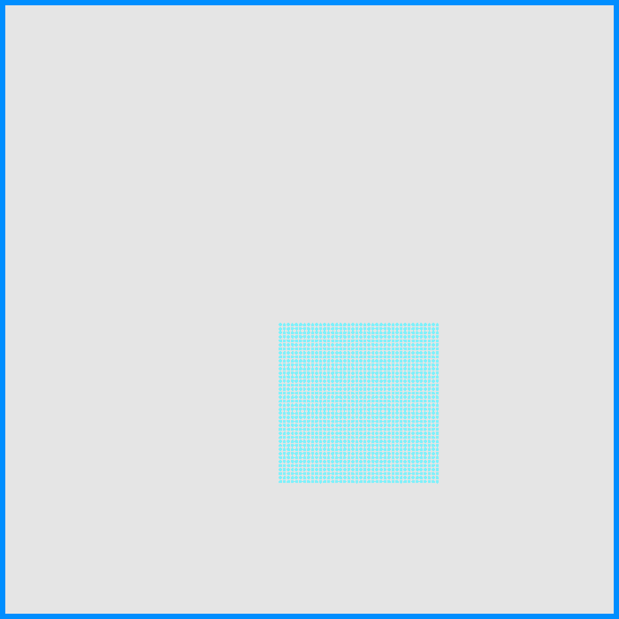

# MPM-code

## Run
You can see the result by simply run the *main.cpp* after you have set up OpenGL for this project. Also, you can change the scene to whatever you want by changing the *main.cpp*. Below are some results.
{: width="20px" height="20px"}
{: width="20px" height="20px"}
{: width="20px" height="20px"}